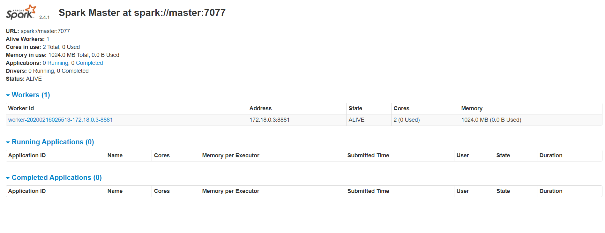
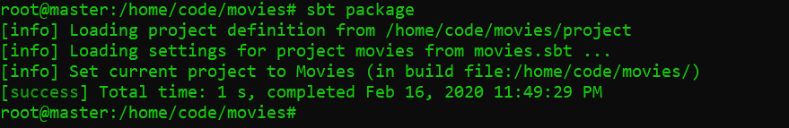
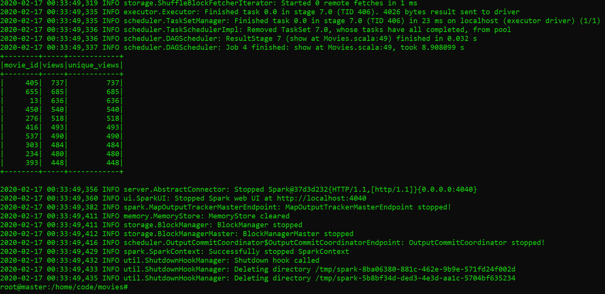
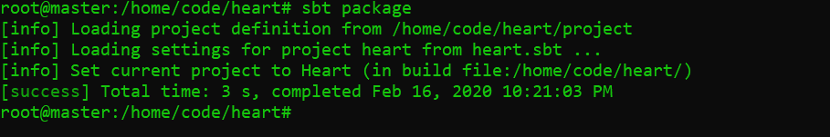
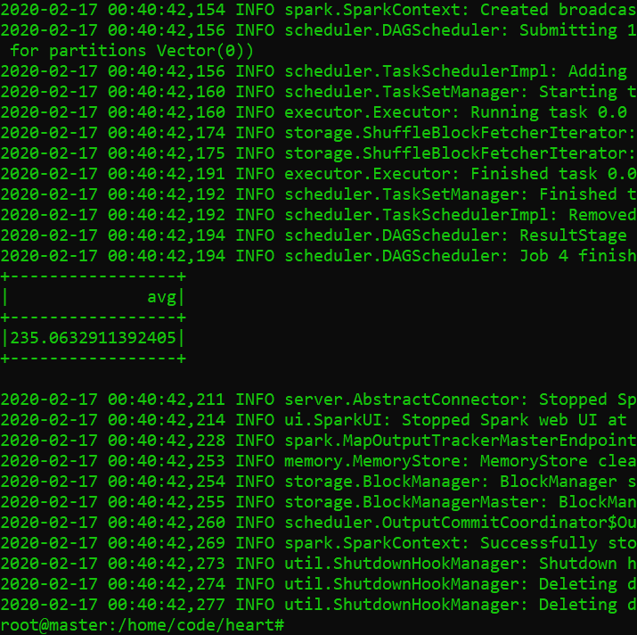
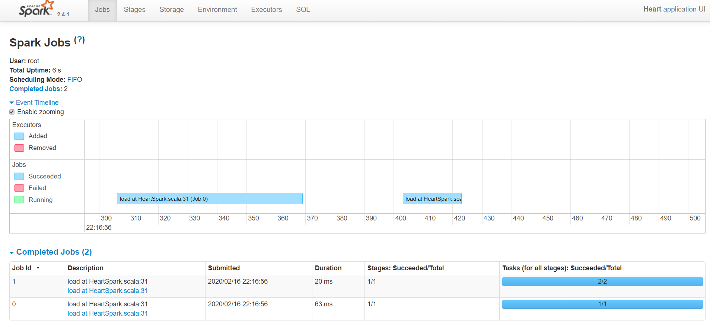
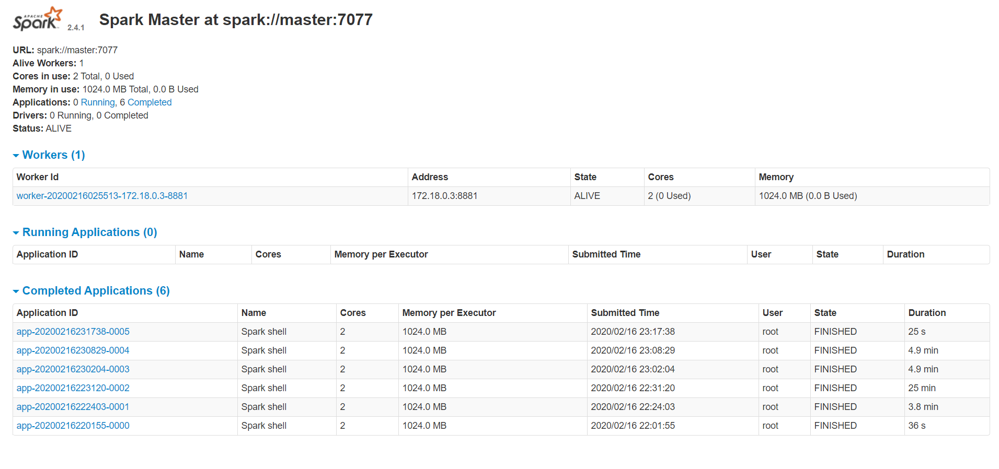

# Reto Spark <!-- omit in toc -->

Primeros pasos en Spark/Scala montado en un contenedor Docker

## Tabla de Contenido<!-- omit in toc -->
- [Retos a realizar](#retos-a-realizar)
  - [Película más Popular](#pel%c3%adcula-m%c3%a1s-popular)
  - [Estadísticas del Corazón](#estad%c3%adsticas-del-coraz%c3%b3n)
- [Metodología de solución](#metodolog%c3%ada-de-soluci%c3%b3n)
- [Ambiente SPARK](#ambiente-spark)
  - [Versiones utilizadas](#versiones-utilizadas)
  - [Requerimientos](#requerimientos)
  - [Contenedor SPARK](#contenedor-spark)
    - [Instalación rápida](#instalaci%c3%b3n-r%c3%a1pida)
    - [Instalación lenta](#instalaci%c3%b3n-lenta)
- [Solución de los ejercicios](#soluci%c3%b3n-de-los-ejercicios)
  - [Reto 1](#reto-1)
  - [Reto 2](#reto-2)
- [Apuntes](#apuntes)

# Retos a realizar
## Película más Popular
El dataset u.data contiene estadísticas de películas vistas antes de la fecha 4/1998. Encontrar las 10 películas más vistas del dataset.

## Estadísticas del Corazón
El dataset heart.csv contiene registros médicos de pruebas cardiovasculares. Encontrar el promedio de colesterol (columna chol) de las personas entre las edades de 40 y 50 años.

Resultados esperados:

	* Especificar entorno de desarrollo utilizado.
	* Especificar version de Spark y Scala.
	* Archivo .scala con la solución de cada uno de los problemas (1 archivo por actividad).
	* Muestra de ejecución (Mostrar resultados).
	* Crear un archivo .jar para ejecución en un cluster de Spark.

# Metodología de solución
Previo a contextualizar sobre Hadoop, Spark y Scala de ahí se continuo de la siguiente manera

* Probar Scala y SBT en Windows 10 junto con Scalafiddle
* Crear un entorno de desarrollo basado en Docker para Spark y Scala
* Aprender sobre SBT y SCALA realizando ejercicios sencillos sobre el lenguaje
* Crear un contenedor con SPARK listo para funcionar en clúster con un maestro y un esclavo
* Compilar un ejemplo de SPARK-SCALA para entender el ambiente y entorno
* Realizar los ejercicios

El procedimiento es el siguiente:

# Ambiente SPARK

## Versiones utilizadas
* SPARK_VERSION 2.4.1
* SCALA 2.11.12
* Java 1.8.0_222

Para obtener las últimas versiones, es necesario reconstruir con el DockerFile de este repositorio. Sin embargo, al ser un contenedor se puede desplegar en cualquier entorno con ambas configuraciones

El Dockerfile fue basado en gettyimages/spark y adaptado al ejercicio (https://hub.docker.com/r/gettyimages/spark/)

## Requerimientos
* Docker (https://www.docker.com/)
* Git (https://git-scm.com/)

Opcional para instalación en windows, ya que se puede trabajar con el contenedor unicamente
* Java 8 (https://adoptopenjdk.net/)
* Scala (https://www.scala-lang.org/download/) 
* SBT (https://www.scala-sbt.org/download.html)

Visualizador de código usado
* VSCode (https://code.visualstudio.com/)
* IntelliJIDEA (https://www.jetbrains.com/es-es/idea/)
* El código se encuentra mapeado a la carpeta ``/scala``

Para probar scripts sencillos en Scala via web
* https://scalafiddle.io/

## Contenedor SPARK

1.- Descarga del repositorio y posicionarse en la carpeta
```shell
git clone https://github.com/eocode/spark-scala.git
cd spark-scala
```

Ahora, se pueden seguir dos caminos, si no importa contar con las últimas versiones ejecutar la versión rápida

### Instalación rápida

Usando la imagen gettyimages/spark

2.- Descargar la imagen construida y lista para usar

```bash
docker pull gettyimages/spark
```

Levantar el entorno con un maestro y un esclavo

```shell
docker-compose up -d
docker ps
```

Después de esto el entorno se encontrará habilitado: 
* Master: http://localhost:8080/
* Worker: http://localhost:8081/

3.- Ingresamos a la consola de comandos para ejecutar las tareas en Scala
```shell
docker exec -it docker-spark_master_1 bash
```

4.- Instalar Scala y el manejador de paquetes SBT en la maquina

```bash
apt-get update && curl -OL https://www.scala-lang.org/files/archive/scala-2.11.12.deb && dpkg -i scala-2.11.12.deb && rm -f scala-2.11.12.deb
apt-get update && curl -OL https://bintray.com/artifact/download/sbt/debian/sbt-1.3.8.deb && dpkg -i sbt-1.3.8.deb && rm -f sbt-1.3.8.deb
```

Listo el entorno está configurado y listo

<div align="center">
  
  <small><p>Spark funcionando en el puerto 8080</p></small>
</div>

### Instalación lenta
Dependiendo de los recursos puede tardar un tiempo, por la descarga, instalación y construcción de la imagen
Imagen preconfigurada con versiones actualizadas, se modifico el dockerfile

2.- Construir la imagen con el ambiente Spark
```shell
docker build -t spark-scala .
```
El comando anterior creara una imagen spark-scala con el S.O. debian con las configuraciones necesarias. 

Para verificar
```bash
docker images
```

Levantar el entorno con un maestro y un esclavo.  Editar antes el docker-compose con el nombre de la imagen spark-scala que se acaba de instalar

```shell
docker-compose up -d
docker ps
```

3.- Ingresamos a la consola de comandos para ejecutar las tareas en Scala
```shell
docker exec -it docker-spark_master_1 bash
```

<div align="center">
  
  <small><p>Imagen creada</p></small>
</div>

Modificar el docker-compose con el nombre de la imagen `spark-scala` antes de ejecutar los siguiente

Levantar el entorno con un maestro y un esclavo

```shell
docker-compose up -d
docker ps
```

Después de esto el entorno se encontrará habilitado: 
* Master: http://localhost:8080/
* Worker: http://localhost:8081/

3.- Ingresamos a la consola de comandos para ejecutar las tareas en Scala
```shell
docker exec -it docker-spark_master_1 bash
```

# Solución de los ejercicios

Los archivos fuente se encuentran dentro de la carpeta /scala

* /code (contiene el código escrito en scala)
* /data (contiene las fuentes de datos)

Dentro del contenedor los archivos se encuentran en /home

Para ejecutar el ejemplo de spark

```bash
cd /home/code/example

sbt package

/usr/spark-2.4.1/bin/spark-submit --class "SimpleApp" --master local[4] target/scala-2.11/simple-project_2.11-1.0.jar

/usr/spark-2.4.1/bin/spark-shell --jars target/scala-2.11/simple-project_2.11-1.0.jar
```

## Reto 1

El dataset u.data contiene estadísticas de películas vistas antes de la fecha 4/1998. Encontrar las 10 películas más vistas del dataset.

Asumiendo que cada fila es una reproducción de la pelicula, se tomaron como visitas los ids de usuario, obteniendo lo siguiente

```scala
// /home/code/movies/src/main/scala/Movies.scala
import scala.io.Source
import org.apache.spark.sql.SparkSession
import scala.reflect.io.Directory
import java.io.File
import scala.util.Try

object Movies {
  def main(args: Array[String]) {
    // Session Spark
    val spark = SparkSession
      .builder()
      .appName("Movies")
      .config("spark.some.config.option", "some-value")
      .getOrCreate()

    // Run Task
    runHeart(spark)

    spark.stop()
  }
  private def runHeart(spark: SparkSession): Unit = {

    import spark.implicits._

    // Read CSV file
    val readMoviesCSV = spark.read
      .format("csv")
      .option("sep", "	")
      .option("inferSchema", "true")
      .option("header", "true")
      .load("/home/data/u.data")

    // Remove parquet
    val directory = new Directory(new File("/home/data/movies.parquet"))
    if(directory.exists){
      directory.deleteRecursively()
      readMoviesCSV.write.parquet("/home/data/movies.parquet")
    }else{
    // Transform to Parket for columnar data
      readMoviesCSV.write.parquet("/home/data/movies.parquet")
    }

    val parquetMoviesFile = spark.read.parquet("/home/data/movies.parquet")
    parquetMoviesFile.createOrReplaceTempView("parquetMoviesFile")
    val top = spark.sql(
      "SELECT movie_id, count(user_id) views, count(distinct user_id) unique_views FROM parquetMoviesFile group by movie_id order by count(user_id) desc limit 10"
    )
    // Show query
    top.select($"movie_id", $"views", $"unique_views").show()
  }
}
```

Para ejecutar el código anterior:

```bash
cd /home/code/movies
sbt package
```

Compila el código y genera el .jar en target/scala-2.11/movies_2.11-1.0.jar

<div align="center">
  
  <small><p>Compilación del programa</p></small>
</div>

Para enviarlo a SPARK

```bash
/usr/spark-2.4.1/bin/spark-submit --class "Movies" --master local[4] target/scala-2.11/movies_2.11-1.0.jar
```

<div align="center">
  
  <small><p>Resultado del programa</p></small>
</div>

## Reto 2

El dataset heart.csv contiene registros médicos de pruebas cardiovasculares. Encontrar el promedio de colesterol (columna chol) de las personas entre las edades de 40 y 50 años.

```scala
// /home/code/heart/src/main/scala/Heart.scala
import scala.io.Source
import org.apache.spark.sql.SparkSession
import scala.reflect.io.Directory
import java.io.File
import scala.util.Try

object HeartSpark {
  def main(args: Array[String]) {
    // Session Spark
    val spark = SparkSession
      .builder()
      .appName("Heart")
      .config("spark.some.config.option", "some-value")
      .getOrCreate()

    // Run Task
    runHeart(spark)

    spark.stop()
  }
  private def runHeart(spark: SparkSession): Unit = {

    import spark.implicits._

    // Read CSV file
    val readHeartCSV = spark.read
      .format("csv")
      .option("sep", ",")
      .option("inferSchema", "true")
      .option("header", "true")
      .load("/home/data/heart.csv")

    // Remove parquet
    val directory = new Directory(new File("/home/data/heart.parquet"))
    if(directory.exists){
      directory.deleteRecursively()
      readHeartCSV.write.parquet("/home/data/heart.parquet")
    }else{
    // Transform to Parket for columnar data
      readHeartCSV.write.parquet("/home/data/heart.parquet")
    }

    val parquetHeartFile = spark.read.parquet("/home/data/heart.parquet")
    parquetHeartFile.createOrReplaceTempView("parquetHeartFile")
    val age = spark.sql(
      "SELECT AVG(chol) as avg FROM parquetHeartFile where age BETWEEN 40 AND 50"
    )
    // Show query
    age.select($"avg").show()
  }
}
```

Para ejecutar el código anterior:

```bash
cd /home/code/heart
sbt package
```

Compila el código y genera el .jar en target/scala-2.11/heart_2.11-1.0.jar

<div align="center">
  
  <small><p>Compilación del programa</p></small>
</div>

Para enviarlo a SPARK

```bash
/usr/spark-2.4.1/bin/spark-submit --class "HeartSpark" --master local[4] target/scala-2.11/heart_2.11-1.0.jar
```

<div align="center">
  
  <small><p>Resultado del programa</p></small>
</div>

Para ejecutar usando spark-shell

```bash
/usr/spark-2.4.1/bin/spark-shell --jars target/scala-2.11/heart_2.11-1.0.jar
```

```scala
HeartSpark.main(Array())
```

La tarea se puede ver en http://localhost:4040

<div align="center">
  
  <small><p>Listado de Jobs</p></small>
</div>

Al final se muestran algunas tareas completadas en Spark

<div align="center">
  
  <small><p>Resultado de ejecución</p></small>
</div>

# Apuntes

Conocimiento adquirido para realizar el ejercicio

[BigData Hadoop Spark SCALA](apuntes/README.md)